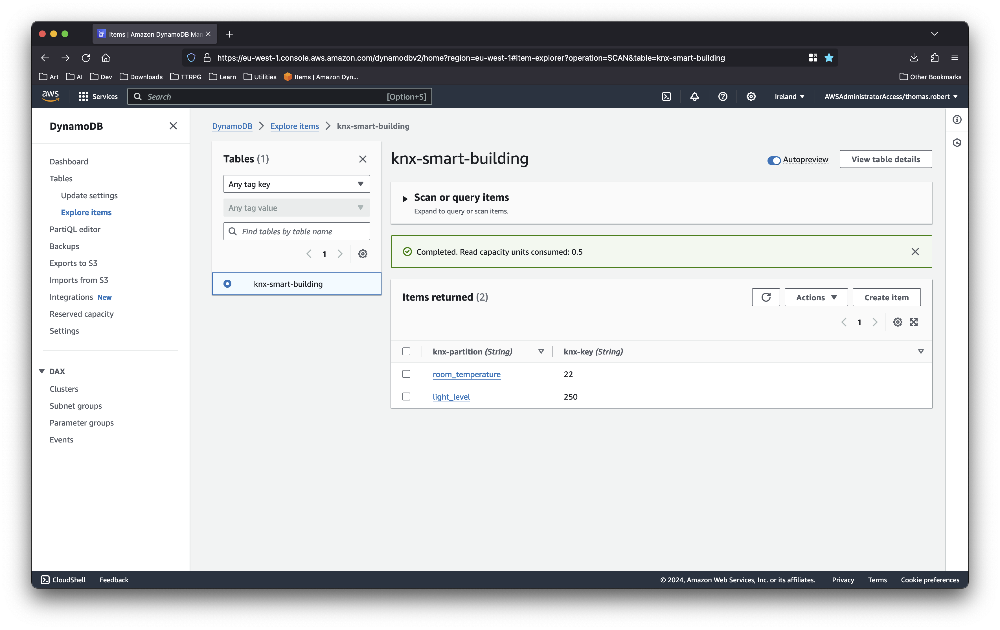
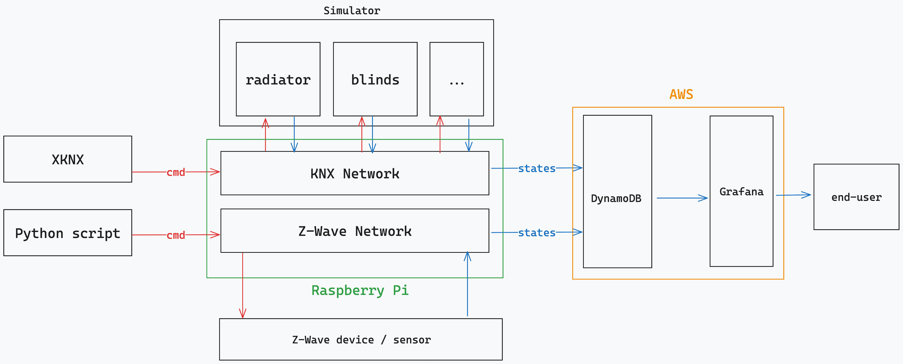

# Report: smart building

_Thomas Robert, Emile Farine_
**11.01.2024**

[TOC]

## Introduction

This report is the result of a project undertaken within the scope of the Internet of Things (IoT) course at MSE Formation, HES-SO. The project's objective was to design and implement a smart building system, utilizing the tools and techniques introduced during the course. The aim is to control IoT devices such as blinds, radiators, and lights, and to provide a user interface for monitoring their status.

The objectives can be resume into three key steps:

- Establish the IoT infrastructure
- Develop a support layer
- Create a front-end interface for end-users

## Implementation

A single, real IoT device was employed for this experiment: a Z-Wave multi-sensor. This device measures temperature, light, humidity, and physical presence. A Raspberry Pi serves as the gateway.

A KNX network is accessible via the [knxd](https://github.com/knxd/knxd) daemon. As we lack the physical infrastructure to manipulate devices such as blinds and radiators, we incorporated a [KNX simulator](https://github.com/isisdaude/simulator-knx). A Python script is utilized to alter the state of the devices in the simulator and transmit the data to the network, with the [xknx](https://github.com/XKNX/xknx) library simplifying the commands.

A DynamoDB database is employed to store the data on the AWS cloud.

The following is an overview of the architecture. The scripts to control the devices are executed on a local machine, but they could also be run directly on the Raspberry Pi.

## Results

The scenarios for the KNX devices are as follows: the blinds close when the light is excessively bright, and the radiators activate when the temperature drops too low. Every hour, the temperature and light status are checked, and the scenarios are implemented if necessary. The data is subsequently sent to the database.

We opted to use [Grafana](https://grafana.com) as the front-end system to present the data to the end-user. It functions as a dashboard for controlling the state of the devices

## Conclusion

Despite challenges with network connectivity and the use of old libraries, this project successfully established an IoT infrastructure for a smart building system. We managed to simulate data and values, providing a comprehensive understanding of an IoT system's event chain.

These results, although achieved under challenging conditions, demonstrate the potential of IoT in controlling and monitoring devices like blinds, radiators, and lights. The use of a DynamoDB database on the AWS cloud further underscores the system's scalability.